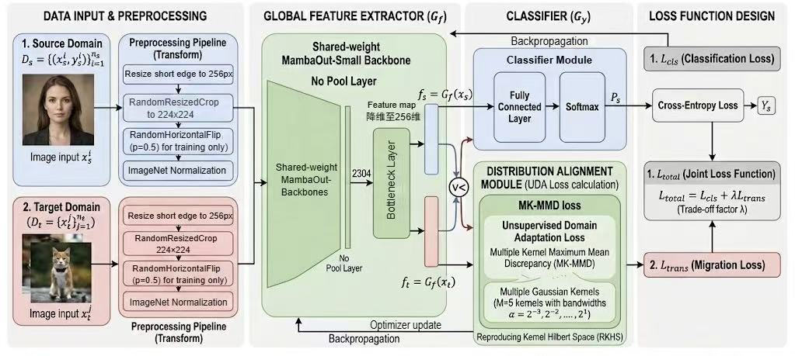
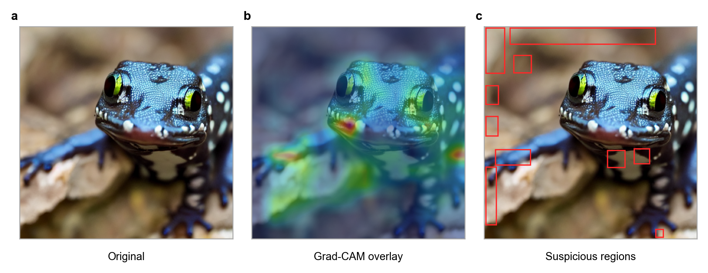
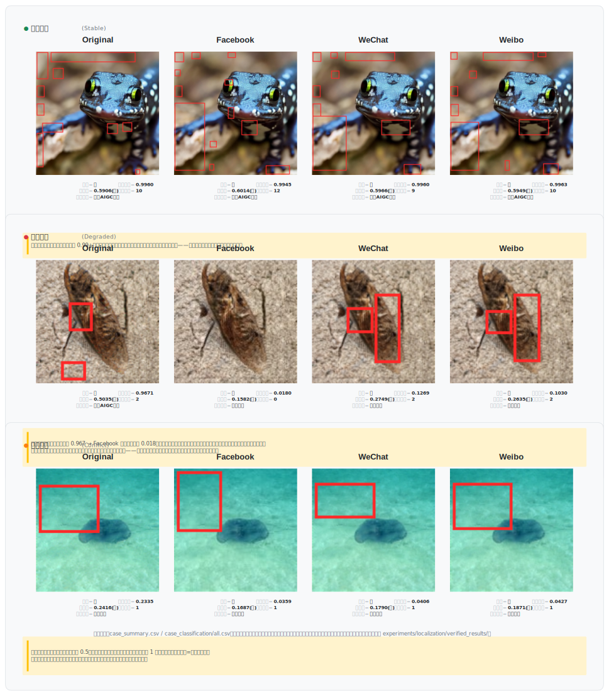

# TraceGuard

# 目 录

摘要

第一章 作品概述

第二章 作品设计与实现

第三章 作品测试与分析

第四章 创新性说明

第五章 总结

参考文献

# 摘要

TraceGuard 是面向社交媒体传播链末端的可解释 AIGC 图像审核平台。系统集成跨域检测、Grad\-CAM、局部定位、五维风险融合与报告导出，并以“全局判断、局部证据、融合结论”三层合同保证 Web、API、CLI 结论一致；证据冲突或退化时转人工，不静默改写全局标签。

针对可绕过生成端对齐并进入假新闻传播的超监管高危内容\[9\]，检测器在未见域的 9 个生成器上取得 98.00% 总体 Fake Recall（公开释出子集，见表 3\.6）。八生成器盲测 Real Recall 为 99.80%。系统已在 RTX 4060 Laptop GPU 完成真实 Web 闭环，短时并发烟测中位延迟为 0.520 秒。

8000 组同图成对实验显示，Facebook 传播使 Fake Recall 从 59.55% 降至 21.675%，平均伪造概率下降 0.3162；确定性扰动进一步确认 JPEG 是主要证据破坏面，jpeg75/jpeg50 保持率仅 16.65%/3.93%。真图对照证伪了 resize50 的表面提升。作品据此量化传播链末端的证据退化，并把不可靠样本分流至人工复核。

关键词:AIGC 内容安全;伪造检测;跨域泛化;可解释取证;篡改定位;风险融合

# 第一章 作品概述

1\.1 背景与威胁

《生成式人工智能服务管理暂行办法》（2023 年 8 月 15 日施行）第十二条要求提供者”对生成内容进行标识”；《互联网信息服务深度合成管理规定》（2023 年 1 月 10 日施行）进一步要求深度合成服务提供者对合成内容添加显式或隐式标识，并建立审核与应急处置机制。上述法规确立了 AIGC 内容可追溯、可标识的合规基线，但对社交媒体传播链末端——经历平台转码、压缩和截图转存后被剥离元数据与显式标识的”裸图”——仍缺乏可部署的第三方审核手段\[10-11\]。

生成式人工智能降低了图像伪造门槛，带来假新闻、舆情误导和电子证据污染。生成端对齐也可能被战争、恐怖主义、枪械等”超监管”内容绕过\[9\]；这些高危图像经历传播后证据衰减，合规标识与元数据在平台处理环节被系统性剥离。因此，传播链末端需要能给出依据、风险和复核记录，并在证据不足时转人工的第三方审核平台。

1\.2 相关工作与现有不足

现有方法分别从统计或频域痕迹\[1\]、预训练表征\[2\]和 Grad\-CAM 归因\[7\]开展检测，但新生成器与重编码会造成域偏移，归因结果也常未进入审核流程。GenImage\[3\]等数据以常规内容为主，针对超监管内容和真实平台传播链的同图成对评价仍不足\[9\]。在政策层面，标识义务与审核需求已明确，但面向传播末端”裸图”的跨域检测与可解释取证工具仍处于研究与工程化早期。TraceGuard 的切入点是把跨域检测、传播评测、并行解释证据和人工复核组织为同一闭环，填补标识失效后的第三道防线。

1\.3 作品定位与应用场景

作品以社交媒体高危假新闻配图筛查为核心，并覆盖平台审核、新闻核验和电子证据初筛。检测器在未见该内容域的条件下，对 9 个超监管生成器的总体 Fake Recall 为 98.00%（表 3\.6）。平台可据风险等级分流；新闻核验可导出证据报告；取证初筛则保留 `label` 与 `tamper_type` 的来源和分歧，供人工鉴定。

1\.4 特色描述与应用前景

作品具有三项特色：一是零样本超监管识别，配合通用盲测的真图低误伤（Real Recall 99.80%）；二是全局判断、局部证据和融合结论分层输出，冲突即转人工；三是 Web、API、CLI 与批量入口复用同一管线，可在单张消费级 GPU 上运行并导出报告。传播链同图成对评测和确定性扰动进一步标定系统边界。系统可用于平台风险分流、新闻核验和证据初筛；超监管概念取自公开文献\[9\]，评测数据取自其公开释出的 ExImage，子集由本作品自建，本作品仅评价自研检测器，不涉及高危内容生成或训练。

1\.5 团队分工与阶段计划

本作品由三名成员协作完成，分工如下：

朱羿帅（系统集成与实验分析）：负责总体架构设计、多证据融合管线集成、Web/API/CLI/批量四入口统一接口实现、全局判定与局部证据的三层输出合同设计及代码级一致性保障；主导社交媒体传播链成对评测、确定性派生扰动实验与超监管高危内容零样本边界评测；完成平台短时并发烟测、报告能力前置叙事重构、三张系统结构图制作、Word 工作稿生成、全量测试维护、提交包运行白名单装配与匿名化红线审计；维护 DEVLOG 与团队分工协调。

张潇（跨域 AIGC 检测与模型训练）：负责跨域检测模块的核心算法设计与实验验证——选取 MambaOut-Small 门控卷积骨干并去除全局池化以保留空间伪影特征，引入五核高斯 MK-MMD 无监督域自适应对齐源域与目标域特征分布，设计差分学习率、Warmup、余弦退火与梯度裁剪的联合训练策略；完成 GenImage 八生成器平衡盲测，实施 MK-MMD 消融实验；编写 REPRODUCIBILITY.md。

贺杰（可解释取证与风险复核）：负责可解释性分析与篡改定位模块的定量评价体系建设——搭建合成篡改数据集生成管线与定位评价框架，实现风险阈值分层校准与留出评估；从 32000 条成对预测中固定稳定/衰减/冲突三类典型案例，完成传播链案例自动分类，生成三类案例证据图，补齐 6 条实验线的 README + provenance.json 交付合规审计。

**阶段计划**：2026 年 7 月 13 日完成跨域盲测、传播成对实验与典型案例固定；7 月 14 日完成扰动实验全量运行与超监管叙事方案落地；7 月 15 日完成报告能力前置叙事转向与系统结构图重做；7 月 17 日完成超监管数据来源纠偏、三类案例图全套产出与交付合规补齐；7 月 18 日完成消融实验受控变量声明修补与案例总图学术重构；7 月 19 日冻结技术内容；7 月 20 日处理封版阻塞问题，完成匿名化终审。

# 第二章 作品设计与实现

2\.1 总体架构

TraceGuard 采用模块化流水线设计。系统接收单张输入图像并完成预处理后，由跨域 AIGC 检测模块给出全局真伪判断；在此基础上，可解释性分析模块与篡改（可疑区域）定位模块并行产出证据，多证据风险融合模块据此形成风险分级；最终结果经 Web 界面可视化展示，并导出结构化检测报告。检测、解释、定位与报告导出被组织为可演示、可测试、可复核的图像安全审核闭环。

图 2\-1 · TraceGuard 系统总体架构。`Detector.predict()` 是 `label` 与 `fake_prob` 的唯一来源；Grad\-CAM 与局部定位作为并行证据分支；风险和文本模块将各来源组织为全局判断、局部证据与融合结论。

2\.2 跨域 AIGC 图像检测模块

跨域检测模块负责对输入图片输出真伪概率和类别标签，是 TraceGuard 的核心判别引擎。由于真实网络传播中 AIGC 图像的来源模型多样，训练域（源域）与测试域（目标域）之间存在显著分布差异，传统单一域训练的检测器在跨生成器、跨数据集场景中容易出现性能下降\[2-3\]。为此，本模块以门控卷积骨干提取判别特征，并引入多核最大均值差异（MK\-MMD）无监督域自适应对齐源域与目标域的特征分布。消融实验显示，MK\-MMD 使八生成器平均 Fake Recall 从 49.59% 提升至 59.55%（绝对提升 +9.96 pp，相对提升 +20.08%，见 3.3.1 消融表），验证了无监督域自适应的跨域泛化贡献。

2\.2\.1 骨干网络设计：MambaOut\-Small 去全局池化

传统 AIGC 检测方法普遍采用 ResNet 或 ViT 等骨干网络，这些网络末端通常包含全局平均池化（Global Average Pooling, GAP）层，将空间特征图压缩为单一特征向量。然而，GAP 的全局平均操作在提取语义信息的同时，会不可逆地破坏 AIGC 图像中关键的微观伪影——例如生成器在像素级留下的网格模式、异常纹理和局部色偏。这些细粒度痕迹恰恰是区分真实图像与 AI 生成图像的重要依据。

本作品选取 MambaOut\-Small 作为骨干网络。MambaOut 是一种基于门控卷积（Gated CNN）的视觉架构，其研究表明部分视觉任务并不必然需要状态空间模型\[4\]。MambaOut\-Small 的具体配置为：4 个阶段，深度 \[3, 4, 27, 3\]，各阶段特征维度 \[96, 192, 384, 576\]，总参数量约 44\.8M（不含新增层）。

核心改进：移除原始 MambaOut 的 GAP 层，将最后一阶段输出的 \(B, 7, 7, 576\) 特征图经 LayerNorm 后进行自适应池化至 \(2, 2\)，展平为 2304 维密集特征向量，完整保留像素级空间结构信息。随后通过瓶颈层（Linear\(2304, 256\) → BatchNorm1d → ReLU）将特征降维至 256 维，在保留判别信息的同时避免后续 MMD 计算遭遇维度灾难。最后接入监督分类头 Linear\(256, 2\) 输出 real/fake 二分类 logits。

图 2\-1b · 跨域检测模块骨干架构。去 GAP 保留 2304 维空间特征，瓶颈降维至 256 维后分流至分类与 MMD 域对齐。

2\.2\.2 无监督域自适应：多核最大均值差异（MK\-MMD）

在无监督域自适应（UDA）设定下，目标域数据无任何类别标注。本模块引入多核最大均值差异（Multi\-Kernel Maximum Mean Discrepancy, MK\-MMD）作为分布对齐正则项\[5\]，在训练阶段将源域和目标域特征映射到再生核希尔伯特空间（RKHS），通过最小化两域在此空间中的经验 MMD 距离学习域不变特征表示。

MK\-MMD 采用 5 个不同带宽的高斯核进行线性组合：

$$k(x, y) = \sum_{u=1}^{5} \exp\left(-\frac{\lVert x - y\rVert^2}{2\sigma_u^2}\right)$$

其中 $\sigma_u$ 采用几何级数分布：$\sigma_u = 2^{u-3} \cdot \bar{d}$，$\bar{d}$ 为批次内样本对的平均欧氏距离。5 个核分别捕获不同尺度的分布差异，使得域对齐对源域与目标域之间的复杂分布偏移具有更强的适应能力。

经验 MMD 距离的计算采用 V\-统计量（V\-statistic）估计器：

$$\widehat{MMD}^2 = \frac{1}{n_s^2}\sum_{i,j} k(x_i^s, x_j^s) + \frac{1}{n_t^2}\sum_{i,j} k(x_i^t, x_j^t) - \frac{2}{n_s n_t}\sum_{i,j} k(x_i^s, x_j^t)$$

该实现参考 Transfer\-Learning\-Library 中的 DAN（Deep Adaptation Networks）模块\[6\]，并根据本任务的数据规模和模型结构进行了适配。

2\.2\.3 联合训练策略

训练阶段采用双流（Two\-Stream）输入架构：每个训练 batch 同时送入源域图像（含 real/fake 标签）和目标域图像（无标签）。训练目标为联合损失函数：

$$\mathcal{L}_{\mathrm{total}} = \mathcal{L}_{\mathrm{cls}} + \beta \cdot \mathcal{L}_{\mathrm{MMD}}$$

其中 $\mathcal{L}_{\mathrm{cls}}$ 为源域交叉熵损失（带标签平滑 0.1），$\mathcal{L}_{\mathrm{MMD}}$ 为源域与目标域 256 维瓶颈特征的 MK\-MMD 距离。平衡因子 $\beta$ 采用渐进调度策略：训练初期设 $\beta = 0$ 让分类器充分学习源域判别特征；在训练过程中 $\beta$ 线性增长至目标值 $\beta_{\max} = 1.0$，逐步增加域对齐的强度。

此外，训练策略还包括以下优化组件：

- **差分学习率**：ImageNet 预训练的骨干网络使用较低学习率 $1 \times 10^{-5}$，新增的瓶颈层和分类头使用较高学习率 $1 \times 10^{-3}$，以防止预训练知识被过度扰动；

- **学习率 Warmup**：前 5 个 epoch 学习率从 0 线性升温至目标值，避免训练初期因随机梯度更新破坏预训练权重；

- **余弦退火调度**：Warmup 结束后采用余弦退火将学习率衰减至初始值的 1%；

- **梯度裁剪**：设置最大梯度范数为 5\.0，防止训练不稳定。

2\.2\.4 模块接口定义

模块对外提供标准化 REST API 接口，输入输出字段定义如下：

| 字段                                  | 类型             | 含义                                                                      |
| ----------------------------------- | -------------- | ----------------------------------------------------------------------- |
| `label`                             | string         | 全局判定 `real`/`fake`，仅由 Detector 产生                                       |
| `fake_prob`                         | float          | 伪造概率，取值 0~1                                                             |
| `tamper_type`                       | string         | 局部证据类型：`confirmed_real`/`local_tamper`/`full_aigc`/`full_aigc_hotspots` |
| `risk_score` / `risk_level`         | float / string | 综合风险分与 low/medium/high 等级                                               |
| `bbox_list`                         | array          | 可疑区域列表，每项含 x/y/w/h、面积与区域风险分                                             |
| `overlay_b64` / `mask_b64`          | string         | 热力图叠加图与热力掩膜（Base64）                                                     |
| `explanation` / `explanation_brief` | string         | 结构化中文解释与一句话摘要                                                           |
| `dimension_scores`                  | object         | 五维风险分量明细（见 2\.4\.5）                                                     |

提供内部接口 `return_features=True` 输出 256 维瓶颈特征，供域对齐训练与特征分析使用；热力图和局部定位分别使用梯度响应与空间特征接口。

2\.3 可解释检测与取证解释模块

可解释模块的数据源头为图像检测主模块，核心作用是面向审核人员说明模型判断依据和证据分歧，输出热力图、可疑目标区域标注、局部异常提示以及标准化文字说明。

2\.3\.1 Grad\-CAM 热力图生成

早期版本通过瓶颈层权重将 256 维特征反向归因到 2×2 空间格点。该方法存在根本性局限，2×2 格点无法实现"精准高亮 AIGC 网格、局部色偏、扩散残差痕迹"的要求，上采样后的热力图本质是 4 个色块的模糊扩散，属于典型的"装饰性热力图"。

升级方案在 MambaOut backbone 的 stage2 输出（384 通道 × 14×14 = 196 个空间格点）上实施 Grad\-CAM\[7\]。注册 forward hook 捕获激活 $A ∈ R^{384×14×14}$，同时注册 backward hook 捕获梯度 $G ∈ R^{384×14×14}$。对 fake 类 logit 反向传播，取梯度空间均值作为通道权重，计算类激活图得到 \[14, 14\] 的热力矩阵：

$$w_c = \frac{1}{Z}\sum_{i,j} G_{c,i,j}, \quad L_{\mathrm{CAM}} = \mathrm{ReLU}\left(\sum_{c} w_c A_c\right)$$

其中$A_c \in \mathbb{R}^{14 \times 14}$为第 $c$个通道的激活图，$G_c$为对应梯度，$Z = 14 \times 14$，再上采样到原图尺寸，并将数值归一化到 \[0, 1\]。空间格点从 4 个提升到 196 个，为展示模型对局部纹理和残差模式的响应提供更细粒度的分类证据，但不把该响应解释为像素级篡改真值。

2\.3\.2 热力图后处理与可视化

Grad\-CAM 输出的热力图首先经过高斯平滑（σ=3\.0），消除 14×14 上采样到原图尺寸时产生的棋盘格伪影。之后通过自定义 Colormap 映射为彩色图像——采用 7 个颜色锚点分段线性插值：

深蓝\(0\.0, 低伪造可疑\) → 青\(0\.4\) → 绿\(0\.55\) → 黄\(0\.7\) → 橙红\(0\.85\) → 红紫\(1\.0, 极高伪造可疑\)。

最终输出两种图像格式：原图与热力图半透明叠加的 `overlay`（α=0\.5，供前端渲染和 PDF 报告），以及纯热力掩膜 `mask`（供取证分析）。前者辅助快速定性判断，后者保留精确的热力分数分布供定量分析。

图 2\-2 · 检测结果与可解释证据示例。a，输入图像；b，Stage2 Grad\-CAM 叠加图；c，局部定位分支给出的可疑区域。热力响应与红框来自不同解释路径，两者仅仅用于指出模型关注和局部异常位置，不等同于像素级篡改真值。

2\.3\.3 自然语言解释生成

采用三段式模板生成标准化中文解释文本。解释内容根据篡改分类结果自动匹配对应描述——确认真实、局部篡改、全图 AIGC 生成、全图 AIGC 含热点区域四种情况各有独立的结论措辞：

【总体结论】判定结果 \+ 篡改类型 \+ 置信度 \+ 风险等级 \+ 处置建议
【取证分析】热力图伪影特征描述（强烈/中等/微弱三档）\+ 响应统计量
【定位详情】逐区域坐标\(x,y,w,h\) \+ 面积\(px\) \+ patch 级风险分 \+ 复核建议

解释文本随检测结果自动生成，可直接嵌入 HTML 报告或导出为纯文本。系统将全局标签 `label`（`real` 或 `fake`）与局部证据类型 `tamper_type` 分栏展示：前者仅由 Detector 产生，后者描述定位分支是否发现异常区域。两类证据不一致时，报告保留分歧并给出人工复核提示，不由局部分支静默改写真伪结论。

2\.4 篡改定位与可疑区域分析模块

篡改定位模块用于发现局部编辑、拼接、重绘或局部 AIGC 替换区域。模块将多尺度滑动窗口检测与特征统计异常分析相结合，并在全局判定与局部定位结果之上引入四象限分类器，区分"全图 AIGC 生成"与"局部篡改"两种不同场景。

2\.4\.1 多尺度滑动窗口检测

将图像分割为重叠的滑动窗口 patch，每个 patch 独立送入 Detector 推理，获得该区域属于 AIGC 伪造的概率。采用两种尺度（224×224 和 160×160，代码层支持扩展到 112×112）独立运行，步长比例 stride\_ratio 控制滑动密度——当前默认 0\.5，即相邻 patch 重叠 50%，可在覆盖密度与推理耗时之间取得平衡。多尺度结果取最大值融合，保留最强信号。

针对推理效率做了多项优化。包括：

- 大图降采样：最长边超过 500px 时先缩至 500px 分析，分析后上采样回原尺寸，大幅减少 patch 总数。

- 批量推理：patch 按 batch\_size=32 合批送入 GPU，减少 kernel launch 开销。

- 置信度过滤：fake\_prob 低于 0\.35 的 patch 直接置零，同时保留一份过滤前的原始分数`_raw_score_map`，供后续局部篡改检测风险评分使用。

- 右下角覆盖：滑动窗口可能遗漏右下角边缘，额外补充一个锚定右下角的 patch。

2\.4\.2 特征统计异常分析

利用 Detector 提供的 stage2 中间层特征（384 通道 × 14×14），计算每个通道在 14×14 空间上的方差作为异常权重，再用该权重加权原始特征得到空间异常图：

$\alpha_c = \frac{\text{Var}(F_c)}{\max_k \text{Var}(F_k)}, \quad S_{\text{feat}}(i,j) = \sum_{c=1}^{C} \alpha_c \cdot |F_c(i,j)|$

其中 $F_c$ 为第 $c$个通道的 14×14 特征图，$C=384$，经双线性上采样和高斯平滑后得到与图像同尺寸的可疑度图。该方法的优势在于单次前向传播、速度极快（\<1ms），且 14×14 空间分辨率能够捕捉局部纹理异常。

2\.4\.3 统一可疑度图生成

PatchAnalyzer 和 FeatureStatsAnalyzer 的输出按加权求和融合为统一可疑度图：

$S(i,j) = 0.4 \cdot S_{\text{patch}}(i,j) + 0.6 \cdot S_{\text{feat}}(i,j)$

feature 权重大于 patch，因为特征统计方法对全局篡改（全图 AIGC）更敏感且无滑动窗口的块状伪影。归一化后进入后处理流水线，最终输出的每个 bbox 附带 `patch_fake_prob` 字段——从 confidence\_floor 过滤前的原始 patch\_score 中提取该区域均值，确保局部篡改场景下即使全局 fake\_prob 很低，可疑区域也能获得反映局部真实威胁程度的风险分。

2\.4\.4 四象限局部篡改分类

在全局判定与局部定位结果之上构建四象限分类器，产生四种独立的局部证据类型。该分类器不改变 Detector 输出的全局标签：

| 全局判定 | 局部定位   | 篡改类型                 | 输出标签 | 含义                              |
| ---- | ------ | -------------------- | ---- | ------------------------------- |
| real | 无 bbox | confirmed\_real      | real | 全图真且局部无异常，双重确认                  |
| real | 有 bbox | local\_tamper        | real | 全局模型判真但 patch 级发现异常，保留证据分歧并提示复核 |
| fake | 无 bbox | full\_aigc           | fake | 全图假，伪影均匀分布，无明显热点                |
| fake | 有 bbox | full\_aigc\_hotspots | fake | 全图假且某些区域伪影更集中，标注重点区域            |

对于 local\_tamper，其设计依据是：全局 softmax 与 patch 级滑窗观察的是不同尺度的证据。小面积异常可能在全图表征中被稀释，也可能来自定位分支的误报，因此系统仅仅将其标记为局部异常证据，并要求人工结合原图、热力图和可疑区域复核。

每个 bbox 区域的局部风险分基于 patch 级 fake\_prob 独立计算：

$R_{\text{local}} = 0.5 \cdot p_{\text{patch}} + 0.5 \cdot \min\left(\frac{A_{\text{bbox}}}{A_{\text{total}}} \times 10,\ 1.0\right)$

其中 $p_{\text{patch}}$ 为该 bbox 区域内所有 patch 的原始 fake\_prob 均值`_raw_score_map`，$A_{\text{bbox}}$ 和 $A_{\text{total}}$ 分别为 bbox 面积与图像总面积。局部风险分由两大维度共同决定：区域本身的 AI 伪造置信度，代表局部纹理伪影强度；篡改区域占整张图的面积比例，代表篡改影响范围。与传统方案使用全局 fake\_prob 不同，patch 级分数确保局部篡改场景下，bbox 仍能获得合理的局部风险分，不受全局低分拖累。

2\.4\.5 全局风险评分

采用五维度加权综合评估整张图像的审核优先级：

$R_{\text{global}} = \sum_{k=1}^{5} w_k \cdot d_k$

其中 $d_k$ 为各维度分数，$w_k$ 为对应权重，$\sum w_k = 1$。

检测置信度（$w=0.30$）直接使用上游 MambaOut 模型输出的 fake\_prob。伪影强度（$w=0.25$）综合热力图的最大响应和平均响应：$0.6 \cdot \max(H) + 0.4 \cdot \overline{H}$，前者捕捉最强伪影信号，后者反映整体覆盖程度。篡改面积比（$w=0.25$）为所有 bbox 面积之和与图像总面积的比值。区域数量（$w=0.10$）采用对数归一化 $\log_2(n+1) / \log_2(6)$，5 个以上可疑区域时该项封顶 1\.0。一致性（$w=0.10$）计算热力图高分区域（前 25% 像素）与篡改掩膜高分区域的 IoU 重叠度——重叠度高说明 Grad\-CAM 解释与定位模块发现相互印证，增强可信度；重叠度低则提示两者可能存在分歧。

| 维度    | 权重    | 计算方式                                        |
| ----- | ----- | ------------------------------------------- |
| 检测置信度 | 0\.30 | fake\_prob                                  |
| 伪影强度  | 0\.25 | 0\.6 × heatmap\_max \+ 0\.4 × heatmap\_mean |
| 篡改面积比 | 0\.25 | Σ bbox\_area / \(W × H\)                    |
| 区域数量  | 0\.10 | $\log_2(n+1) / \log_2(6)$                   |
| 一致性   | 0\.10 | IoU(热力图高分区域, 掩膜高分区域)                        |

风险等级分为三档：low [0, 0.35) 绿色、medium [0.35, 0.70) 橙色、high [0.70, 1.0] 红色。当前生产配置仍保留这组可解释边界；在 Facebook 派生平衡集上另行得到 medium 候选边界 0.3947 和 high 候选边界 0.4232，并以未参与选阈值的留出集报告结果。候选边界尚未替换生产配置，也不能外推到其他来源。

2\.5 多证据风险融合模块

融合模块已实现为 2\.4\.5 所述的五维加权评分：输入全部来自上游合同字段（检测置信度、热力图统计、定位掩膜与 bbox 列表），输出 `risk_score`、低/中/高 `risk_level` 与报告化原因，用于排定人工复核优先级；融合结论不改写 Detector 的全局标签。当前等级边界为可解释的固定规则，其数据驱动校准结果与外推边界见 3\.4。

2\.6 平台实现与交互流程

TraceGuard 当前使用同一 `ExplanationPipeline` 支撑 Web、FastAPI、CLI 与批量分析入口。浏览器工作台由 `web/` 提供，正式接口包括健康检查、配置读取、单图分析和批量分析；CLI 与批量脚本复用相同检测器和解释管线，不在前端或脚本中重新计算真伪结论。

Web 最小闭环包括：用户上传图片，系统调用检测模型，展示真伪概率、风险等级、可解释图和定位结果，并生成单图检测报告。批量入口用于实验阶段导出 CSV/JSON 结果。

图 2\-3 · Web 平台检测流程。界面完成输入校验后调用统一分析接口，在加载或错误状态下保留明确反馈；分析完成后分栏呈现全局标签和局部证据，并支持人工复核与报告导出。

2\.7 工程基础与扩展边界

TraceGuard 的当前提交范围聚焦 AIGC 图像证伪检测，不包含音频、视频或其他模态能力。系统设计、测试分析和创新性说明均围绕跨域图像检测、可解释证据、局部定位、风险融合与报告导出展开；未进入当前代码和实验合同的能力不写为已实现功能。

# 第三章 作品测试与分析

3\.1 测试目标与总体方案

测试回答未知生成器识别和传播后证据保持两个问题。跨生成器盲测使用平衡 real/fake 集；传播实验按固定 `sample_id` 成对比较 Original 与平台版本，并用确定性扰动拆解退化来源。全部预测由固定权重和统一 `Detector` 产生，记录逐样本结果与运行信息。

3\.2 数据来源与指标定义

GenImage\[3\]测试包含八个生成器各 1000 张 fake，并配 1000 张 real。传播实验含 8000 组 Original/Facebook/WeChat/Weibo 图像；平台分类集每个平台含 500 real、4500 fake；派生实验另取 1000 real 作假阳对照。GenImage 采用 CC BY-NC-SA 4.0 非商业条款\[8\]，派生归档不发布。

Accuracy 为正确率，Macro F1 为两类 F1 均值，ROC AUC 以 `fake_prob` 为正类分数；Recall 分类别统计；保持率为传播后与 Original 的 Fake Recall 比值；成对概率变化为同一图像传播前后 `fake_prob` 差值均值。固定权重在 GPU 与独立环境所得 Original Fake Recall 为 59.55% 和 59.54%。

3\.3 图像检测与传播鲁棒性实验

**3\.3\.1 跨生成器识别能力盲测（表 3\.1）**

每组由 1000 real 与 1000 目标生成器 fake 构成，Accuracy 同时受两类 Recall 影响。

表 3\.1 · GenImage 八生成器平衡盲测结果

| 生成器        | Accuracy | Real Recall | Fake Recall |
| ---------- | --------:| -----------:| -----------:|
| ADM        | 68.40%   | 99.80%      | 37.00%      |
| BigGAN     | 97.35%   | 99.80%      | 94.90%      |
| Glide      | 86.35%   | 99.80%      | 72.90%      |
| Midjourney | 74.50%   | 99.80%      | 49.20%      |
| SD14       | 86.15%   | 99.80%      | 72.50%      |
| SD15       | 86.45%   | 99.80%      | 73.10%      |
| VQDM       | 56.50%   | 99.80%      | 13.20%      |
| Wukong     | 81.70%   | 99.80%      | 63.60%      |
| 宏观平均       | 79.68%   | —           | —           |

BigGAN Fake Recall 为 94.90%，VQDM 和 ADM 仅 13.20%、37.00%；Real Recall 均为 99.80%。平均 Accuracy 79.68% 不代表所有生成器均稳定。

**MK-MMD 消融验证（表 3.1b）**：消融两臂为两次独立训练（唯一差异：MMD 权重 \(\beta=0\) vs \(\beta\)=1.0），共享同一数据划分。MK-MMD 使八生成器平均 Fake Recall 从 49.59% 提升至 59.55%（绝对 +9.96 pp，相对 +20.08%）。

| 生成器        | 无 MMD FakeR | +MK-MMD FakeR | \(\Delta\)   |
| ----------:| -----------:| -------------:| ------------:|
| ADM        | 25.3%       | 37.0%         | +11.7%       |
| BigGAN     | 73.3%       | 94.9%         | +21.6%       |
| Glide      | 65.7%       | 72.9%         | +7.2%        |
| Midjourney | 43.7%       | 49.2%         | +5.5%        |
| SD14       | 63.9%       | 72.5%         | +8.6%        |
| SD15       | 65.7%       | 73.1%         | +7.4%        |
| VQDM       | 8.9%        | 13.2%         | +4.3%        |
| Wukong     | 50.3%       | 63.6%         | +13.3%       |
| **均值**     | **49.59%**  | **59.55%**    | **+9.96 pp** |

> 两臂为独立训练，+9.96 pp 含训练随机性成分；两项指标需配合观察——Accuracy 同时受 Real Recall 与 Fake Recall 影响（Balanced Test 下 Acc = (RR+FR)/2），各生成器 FR 提升幅度差异显著。

**3\.3\.2 社交媒体传播退化（表 3\.2、表 3\.3）【中心】**

成对集仅含 fake，故报告 Fake Recall、概率变化和保持率，不计算完整二分类指标。

表 3\.2 · GenImage 成对传播实验总体结果

| 条件       | 样本数  | Fake Recall | 平均 fake_prob | 相对 Original 概率变化 | Fake Recall 保持率 |
| -------- | ----:| -----------:| ------------:| ----------------:| ---------------:|
| Original | 8000 | 59.55%      | 0.5909       | 0.0000           | 100.00%         |
| Facebook | 8000 | 21.675%     | 0.2747       | -0.3162          | 36.398%         |
| WeChat   | 8000 | 48.1875%    | 0.4952       | -0.0957          | 80.919%         |
| Weibo    | 8000 | 47.5125%    | 0.4919       | -0.0990          | 79.786%         |

图 3\.1 · 传播前后 Fake Recall 与成对概率变化；固定权重单次结果，不表示置信区间。

Facebook 将 Fake Recall 从 59.55% 降至 21.675%，平均概率下降 0.3162；WeChat、Weibo 保持率约 81%。

图 3\.2 · 各生成器传播后 Fake Recall 保持率及 Original 基线。

Facebook 对 BigGAN/VQDM/ADM/Glide 的保持率仅 2.5%/2.3%/4.9%/11.8%，Midjourney/Wukong 为 78.7%/63.5%。VQDM 原始 Recall 仅 13.2%，故必须同时看绝对值与保持率。

平台分类集与成对集构成不同，每个平台含 500 real、4500 fake。

表 3\.3 · 三平台分类集结果

| 平台       | Accuracy | Macro F1 | ROC AUC | Real Recall | Fake Recall |
| -------- | --------:| --------:| -------:| -----------:| -----------:|
| Facebook | 92.64%   | 84.28%   | 99.29%  | 98.60%      | 91.98%      |
| WeChat   | 92.50%   | 84.01%   | 99.29%  | 98.20%      | 91.87%      |
| Weibo    | 92.60%   | 84.24%   | 99.30%  | 98.80%      | 91.91%      |

分类集回答平台集表现，成对集回答同图证据变化；两者不可替代。

**3\.3\.3 派生扰动深入分析（表 3\.4、表 3\.5）【新增】**

为拆解平台黑箱处理，对 8000 张 fake 施加 jpeg75、jpeg50、resize50 和 screenshot，并以真图检查 resize50 异常。

表 3\.4 · 派生扰动 Fake Recall 保持率（GenImage 全量 8000 样本 × 5 条件，同一份固定检测权重，40000 条预测 0 失败）

| 条件         | Fake Recall | 保持率       |
| ---------- | -----------:| ---------:|
| Original   | 59.54%      | 100.0%    |
| jpeg75     | 9.91%       | 16.65%    |
| jpeg50     | 2.34%       | 3.93%     |
| resize50   | 82.13%      | 137.94% † |
| screenshot | 24.39%      | 40.96%    |

† resize50 为重采样偏置假象。JPEG 是主要破坏面：jpeg75/jpeg50 保持率仅 16.65%/3.93%，与 Facebook 退化互证。resize50 将各生成器 Recall 拉至约 0.83--0.89，VQDM 从 0.131 升至 0.834，提示模型把重采样本身读作伪影。

表 3\.5 · resize50 真图假阳检查（1000 张真图，同一份固定检测权重）

| 变体          | 真图假阳率(FP) | mean fake_prob |
| ----------- | ---------:| --------------:|
| 原图-真图       | 1.50%     | 0.096          |
| resize50-真图 | 17.50%    | 0.245          |

真图假阳率由 1.50% 升至 17.50%，出现 160 例 real→fake、0 例反向，证明表 3.4 的 137.94% 并非鲁棒性收益，需转人工复核。

**3\.3\.4 超监管高危内容零样本边界（表 3\.6、表 3\.7）【新增】**

超监管概念取自公开文献\[9\]，评测数据取自其公开释出的 ExImage，子集（9 生成器 × 250）由本作品自建。本作品仅以固定权重零样本评价共 2250 张 fake，不生成、训练或优化高危内容。公开释出的 ExImage 仅含 fake、未释出 real 半区，故本内容域的真图假阳率无法在公开子集上复现，真图判别力以通用八生成器盲测 Real Recall 99.80% 为准。

表 3\.6 · 超监管高危内容零样本识别（2250 fake / 9 生成器，公开释出子集）

| 项目             | Fake Recall |
| -------------- | -----------:|
| BigGAN         | 98.8%       |
| CycleGAN       | 100.0%      |
| DALLE          | 97.6%       |
| Flux           | 100.0%      |
| Glide          | 98.4%       |
| LatentDM       | 99.6%       |
| Midjourney     | 92.4%       |
| SD14           | 95.6%       |
| SD15           | 99.6%       |
| **总体（2250 张）** | **98.00%**  |

九个生成器 Fake Recall 为 92.4%--100.0%，总体 98.00%。因生成器构成不同且无 VQDM、ADM 难例，仅支持“可跨内容域迁移”的方向性结论。

表 3\.7 · 超监管 fake 传播扰动保持率（与表 3\.4 同口径）

| 条件         | Fake Recall | 保持率    |
| ---------- | -----------:| ------:|
| original   | 98.00%      | 100.0% |
| jpeg75     | 19.38%      | 19.8%  |
| jpeg50     | 12.00%      | 12.2%  |
| resize50   | 99.07%      | 101.1% |
| screenshot | 55.69%      | 56.8%  |

JPEG75/50 保持率仅 19.8%/12.2%，表明“零样本识别强、抗压缩弱”。结果仅刻画自研检测器边界，不构成生产保证。

3\.4 可解释、篡改定位与人工复核价值（表 3\.8）

3 个样本、9 个传播对得到 3 个稳定、1 个退化、2 个退化冲突和 3 个冲突对；全局结果来自 Detector，局部证据来自定位分支。

图 3\.3 · 稳定、退化和冲突案例。红框为工程线索，不代表像素真值。

退化案例概率由 0.967 降至 0.018；冲突案例保留全局与局部分歧，均转人工。定位边界集含 10 个合成篡改与 5 个 clean 对照。

表 3\.8 · 定位分支像素级边界评价（90 百分位，10 tampered + 5 clean）

| 指标                 | 数值     | 指标        | 数值     |
| ------------------ | ------:| --------- | ------:|
| 图像级 Detection Rate | 100%   | Avg IoU   | 0.0148 |
| Dice / Pixel F1    | 0.0286 | 像素 Recall | 0.1360 |
| 像素 Precision       | 0.0171 | clean 误报率 | 100%   |

最优 Dice/F1 仅 0.0326，clean 误报未消除，故 bbox 仅作复核线索。风险校准用 200 张平衡集按 60/40 分层；留出集复核 F1=0.9877、高风险 F1=1.0。候选阈值未替换生产配置，不外推至其他域。

3\.5 平台闭环与案例验证（表 3\.9）

闭环验收覆盖上传、结论、证据、风险和报告；真实自然篡改与更多来源标注仍待补充。

表 3\.9 · 平台闭环验收结果

| 验收项    | 环境或输入                           | 结果                                    | 解释边界                     |
| ------ | ------------------------------- | ------------------------------------- | ------------------------ |
| 自动化回归  | GPU 运行环境                        | 191/191 通过                            | 验证代码行为，不替代模型泛化实验         |
| 健康检查   | `GET /api/v1/health`            | 200，`model_loaded=true`，CUDA 可用       | 单机启动状态                   |
| 单图分析   | 真实权重与固定 BigGAN 样例               | 200；全局 `label` 与局部 `tamper_type` 分栏返回 | 单样例合同验收                  |
| 桌面浏览器  | 1440×1000                       | 上传、分析、证据展示通过，控制台 0 错误                 | 非压力测试                    |
| 窄屏浏览器  | 390×844                         | 页面无重叠，结论与证据完整显示                       | 非设备兼容性全覆盖                |
| 短时并发烟测 | RTX 4060 Laptop GPU，12 请求，并发度 3 | 12/12 成功；中位延迟 0.520 s，P95 2.075 s     | 单样例、短时单机运行，不代表容量上限或长期稳定性 |

**边界**：结果为固定权重单次运行；烟测不代表容量；案例不替代定量评价；resize50 是偏置；定位精度低、风险阈值来源单一；跨域消融仍待原表。

# 第四章 创新性说明

4\.1 超监管高危场景的零样本识别力与真图判别

未见域的 9 个超监管生成器 Fake Recall 为 92.4%--100.0%，总体 98.00%（表 3\.6）；通用盲测 Real Recall 为 99.80%。因生成器构成不同且缺 VQDM、ADM 难例，仅主张识别能力可跨内容域迁移。

4\.2 三层输出合同与可信路由:证据退化即转人工

全局 `label` 与 `fake_prob` 仅由 Detector 产生，解释和定位并行输出，冲突即转人工。风险融合给出分级和报告，但不改写全局标签。留出集复核 F1 为 0.9877；阈值仅适用于当前来源，未替换生产配置。

4\.3 平台的自我诊断能力:传播链末端证据退化的系统度量

同图成对协议量化传播前后证据：Facebook Fake Recall 从 59.55% 降至 21.675%，平均概率下降 0.3162。确定性扰动定位 JPEG 为主要破坏面；真图假阳率由 1.50% 升至 17.50%，证伪 resize50 的表面提升。系统据此识别结论失真并转人工。

4\.4 去全局池化的门控卷积骨干

去除 MambaOut 末端全局池化，将 2×2 特征展平为 2304 维并压缩至 256 维，在控制域对齐开销时保留空间伪影。

4\.5 多核 MMD 的无监督域自适应机制

5 核高斯 MK\-MMD 无需目标域标签即可对齐多尺度分布。消融实验显示 MK\-MMD 使八生成器平均 Fake Recall 从 49.59% 提升至 59.55%（绝对 +9.96 pp，相对 +20.08%，见表 3.1b），BigGAN 提升最大 (+21.6%)，ADM 和 Wukong 亦显著 (+11.7%、+13.3%)。

4\.6 可解释取证与报告化闭环

系统构建三条独立证据路径的交叉验证体系：梯度反向传播的 Grad-CAM（Stage2 14×14，196 个空间格点）揭示模型关注的伪影区域，多尺度滑动窗口（224×224 + 160×160）独立逐 patch 推理捕获局部异常，通道方差统计（单次前向、<1 ms）从中间层特征的分布异质性角度提供补充信号。三路来源不同、不存在信息泄漏，分别从梯度响应、预测置信度和特征统计三个维度观察同一图像，互验增强证据可信度。

取证结果经五维风险融合（检测置信度、伪影强度、篡改面积比、区域数量、一致性）形成分层风险等级，并由三段式模板生成标准化中文解释——【总体结论】给出判定与处置建议，【取证分析】描述热力图响应统计量，【定位详情】逐区域列出坐标与风险分。一次流水线调用同步产出热力图叠加图、掩膜、红框标注图、结构化文本解释及维度分项分数，可直接嵌入 HTML 报告或导出为 PDF，实现从检测分数到审核证据包的闭环转换，使机器判定可被人复核、沟通和归档。

4\.7 轻量化部署与平台化工程闭环

约 45.44M 参数的模型已在 RTX 4060 Laptop GPU 完成 Web 闭环；12 请求并发烟测全部成功，中位延迟 0.520 秒。四个入口复用统一管线和合同。

# 第五章 总结

TraceGuard 已实现跨域检测、Grad\-CAM、局部定位、五维风险融合以及 Web/API/CLI/报告闭环。超监管零样本 Fake Recall 为 98.00%；Facebook 传播使 Fake Recall 从 59.55% 降至 21.675%，确定性实验进一步确认 JPEG 是主要证据破坏面。

系统坚持“全局判断、局部证据、融合结论”三层合同，证据冲突或退化即转人工，不静默改判。当前定位精度和单来源阈值限制了结论外推；后续工作将补齐独立来源评价。

# 参考文献

\[1\] S.\-Y. Wang *et al.*, “CNN-generated images are surprisingly easy to spot... for now,” *CVPR*, 2020, pp. 8692-8701.

\[2\] U. Ojha, Y. Li, and Y. J. Lee, “Towards universal fake image detectors that generalize across generative models,” *CVPR*, 2023, pp. 24480-24489.

\[3\] M. Zhu *et al.*, “GenImage: A million-scale benchmark for detecting AI-generated image,” *NeurIPS 36*, 2023, pp. 77771-77782.

\[4\] W. Yu and X. Wang, “MambaOut: Do we really need Mamba for vision?” *CVPR*, 2025, pp. 4484-4496.

\[5\] A. Gretton *et al.*, “A kernel two-sample test,” *JMLR*, vol. 13, no. 25, pp. 723-773, 2012.

\[6\] M. Long *et al.*, “Learning transferable features with deep adaptation networks,” *ICML*, vol. 37, 2015, pp. 97-105.

\[7\] R. R. Selvaraju *et al.*, “Grad-CAM: Visual explanations from deep networks via gradient-based localization,” *ICCV*, 2017, pp. 618-626.

\[8\] GenImage Dataset, “GenImage dataset license,” GitHub, 2023, https://github.com/GenImage-Dataset/GenImage/blob/main/License.

\[9\] W. Mu *et al.*, “ExDA: Towards universal detection and plug-and-play attribution of AI-generated ex-regulatory images,” *ACM MM*, 2025, pp. 11512-11521, doi: 10.1145/3746027.3755434.

\[10\] 国家互联网信息办公室,《生成式人工智能服务管理暂行办法》, 2023 年 8 月 15 日施行.

\[11\] 国家互联网信息办公室,《互联网信息服务深度合成管理规定》, 2023 年 1 月 10 日施行.
