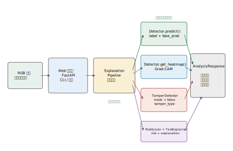
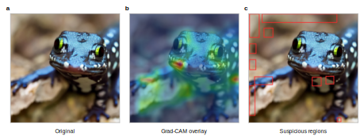
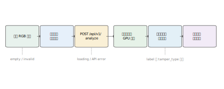
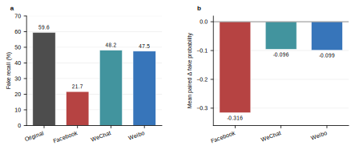
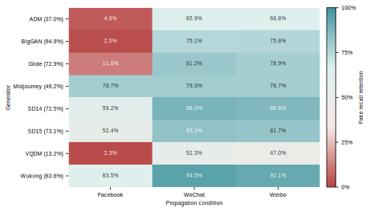
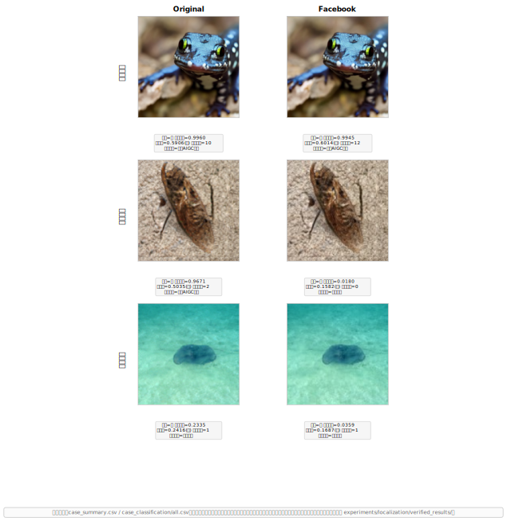

# TraceGuard

# 目 录

摘要

第一章 作品概述

第二章 作品设计与实现

第三章 作品测试与分析

第四章 创新性说明

第五章 总结

参考文献

# 摘要

TraceGuard 面向 AIGC 图像在网络传播、新闻图片审核、平台内容治理和电子证据核验中的安全风险，构建一个集跨域真伪检测、可解释证据展示、篡改区域定位、风险融合和检测报告导出于一体的图像安全审核平台。报告主线聚焦 AIGC 图像证伪检测。

系统已实现图片上传检测、AIGC 真伪概率输出、低/中/高风险等级判定、热力图与可疑区域展示、多证据融合、典型案例展示和单图检测报告导出。技术实现上，TraceGuard 以跨域 AIGC 图像检测为主判别路线，以可解释分析和篡改定位提供并行证据，并通过 Web UI、CLI 和 API 支持演示、批量测试与系统集成。

测试覆盖八类生成器、三类社交平台传播条件与真实浏览器闭环，使用 Accuracy、Macro F1、ROC AUC、Recall、成对概率变化和性能保持率评价检测能力，并结合稳定、传播退化和证据冲突案例说明系统如何支撑人工复核。当前结果同时揭示了 Facebook 传播条件下的显著性能退化，定位定量评价和风险阈值校准仍需补充。

关键词：AIGC 内容安全；伪造检测；跨域泛化；可解释取证；篡改定位；风险融合

# 第一章 作品概述

1\.1 背景分析

生成式人工智能显著降低了图像内容的生成和编辑门槛，也带来了虚假新闻配图、舆情误导、身份冒用、电子证据污染和平台内容审核压力。仅给出“真/假”标签的检测器难以满足实际安全审核需求，因为审核人员还需要知道模型依据、可疑区域、风险等级以及可复核的检测记录。

TraceGuard 将参赛作品定位为信息安全场景下的 AIGC 图像安全审核平台，而不是单一模型演示。作品关注真实传播环境中的跨域泛化和可解释取证：同一检测系统需要面对不同生成器、不同数据集、不同图像风格以及压缩、缩放、裁剪、截图转存等扰动后的内容。

1\.2 相关工作与现有不足

现有 AIGC 图像检测方法通常依赖训练数据中的统计纹理、频域特征或模型生成痕迹，在同域测试中可以取得较好效果，但在新生成模型、新分辨率、新压缩链路或二次传播场景中容易出现性能下降\[1-2\]。另一方面，许多检测系统缺少面向审核人员的解释展示和报告导出能力，难以形成完整的安全处置闭环。

1\.3 作品定位与应用场景

本作品面向开放式自主命题作品赛，核心场景包括平台内容审核、新闻图片核验、社交媒体谣言筛查、电子证据初筛和人工复核辅助。系统输出不仅包括真伪概率，还包括风险分数、可疑区域、解释文本和报告化结论，使检测结果能够被复核、沟通和归档。

1\.4 团队分工与阶段计划

阶段安排：6 月 27 日至 7 月 1 日完成报名、定题和接口确认；7 月 2 日至 7 月 10 日完成最小可演示系统；7 月 11 日至 7 月 20 日完成跨域、鲁棒性和 baseline 对比实验；7 月 21 日至 7 月 28 日完成报告与答辩材料；7 月 29 日至 8 月 2 日完成封版提交。

# 第二章 作品设计与实现

2\.1 总体架构

TraceGuard 的总体流程为：输入图像 \-\> 图像预处理 \-\> 跨域 AIGC 检测模块 \-\> 可解释性分析模块 \-\> 篡改或可疑区域定位 \-\> 多证据风险融合 \-\> Web 可视化展示 \-\> 检测报告导出。系统采用模块化设计，将检测、解释、定位和报告导出组织为可演示、可测试、可复核的图像安全审核闭环。

图 2\-1 · TraceGuard 系统总体架构。`Detector.predict()` 是 `label` 与 `fake_prob` 的唯一来源；Grad\-CAM 与局部定位作为并行证据分支；风险和文本模块将各来源组织为全局判断、局部证据与融合结论。

2\.2 跨域 AIGC 图像检测模块

跨域检测模块负责对输入图片输出真伪概率和类别标签，是 TraceGuard 的核心判别引擎。由于真实网络传播中 AIGC 图像的来源模型多样，训练域（源域）与测试域（目标域）之间存在显著分布差异，传统单一域训练的检测器在跨生成器、跨数据集场景中容易出现性能下降\[2-3\]。为此，本模块采用"门控卷积骨干 \+ 多核最大均值差异（MK\-MMD）无监督域自适应"的技术路线；其跨域贡献仍需消融原始表支持，本报告不提前写成已验证提升。

2\.2\.1 骨干网络设计：MambaOut\-Small 去全局池化

传统 AIGC 检测方法普遍采用 ResNet 或 ViT 等骨干网络，这些网络末端通常包含全局平均池化（Global Average Pooling, GAP）层，将空间特征图压缩为单一特征向量。然而，GAP 的全局平均操作在提取语义信息的同时，会不可逆地破坏 AIGC 图像中关键的微观伪影——例如生成器在像素级留下的网格模式、异常纹理和局部色偏。这些细粒度痕迹恰恰是区分真实图像与 AI 生成图像的重要依据。

本作品选取 MambaOut\-Small 作为骨干网络。MambaOut 是一种基于门控卷积（Gated CNN）的视觉架构，其研究表明部分视觉任务并不必然需要状态空间模型\[4\]。MambaOut\-Small 的具体配置为：4 个阶段，深度 \[3, 4, 27, 3\]，各阶段特征维度 \[96, 192, 384, 576\]，总参数量约 44\.8M（不含新增层）。

核心改进：移除原始 MambaOut 的 GAP 层，将最后一阶段输出的 \(B, 7, 7, 576\) 特征图经 LayerNorm 后进行自适应池化至 \(2, 2\)，展平为 2304 维密集特征向量，完整保留像素级空间结构信息。随后通过瓶颈层（Linear\(2304, 256\) → BatchNorm1d → ReLU）将特征降维至 256 维，在保留判别信息的同时避免后续 MMD 计算遭遇维度灾难。最后接入监督分类头 Linear\(256, 2\) 输出 real/fake 二分类 logits。

2\.2\.2 无监督域自适应：多核最大均值差异（MK\-MMD）

在无监督域自适应（UDA）设定下，目标域数据无任何类别标注。本模块引入多核最大均值差异（Multi\-Kernel Maximum Mean Discrepancy, MK\-MMD）作为分布对齐正则项\[5\]，在训练阶段将源域和目标域特征映射到再生核希尔伯特空间（RKHS），通过最小化两域在此空间中的经验 MMD 距离学习域不变特征表示。

MK\-MMD 采用 5 个不同带宽的高斯核进行线性组合：

$ k(x, y) = \sum_{u=1}^{5} \exp\left(-\frac{|x - y|^2}{2\sigma_u^2}\right)$

其中 \($\sigma_u$\) 采用几何级数分布：\($\sigma_u = 2^{u-3} \cdot \bar{d}$\)，\($\bar{d}$\) 为批次内样本对的平均欧氏距离。5 个核分别捕获不同尺度的分布差异，使得域对齐对源域与目标域之间的复杂分布偏移具有更强的适应能力。

经验 MMD 距离的计算采用 V\-统计量（V\-statistic）估计器：

$ \widehat{MMD}^2 = \frac{1}{n_s^2}\sum_{i,j} k(x_i^s, x_j^s) + \frac{1}{n_t^2}\sum_{i,j} k(x_i^t, x_j^t) - \frac{2}{n_s n_t}\sum_{i,j} k(x_i^s, x_j^t)$

该实现参考 Transfer\-Learning\-Library 中的 DAN（Deep Adaptation Networks）模块\[6\]，并根据本任务的数据规模和模型结构进行了适配。

2\.2\.3 联合训练策略

训练阶段采用双流（Two\-Stream）输入架构：每个训练 batch 同时送入源域图像（含 real/fake 标签）和目标域图像（无标签）。训练目标为联合损失函数：

$ \mathcal{L}{total} = \mathcal{L}{cls} + \beta \cdot \mathcal{L}_{MMD} $

其中 \($\mathcal{L}{cls}$*\) 为源域交叉熵损失（带标签平滑 0\.1），\(*$\mathcal{L}{MMD}$\) 为源域与目标域 256 维瓶颈特征的 MK\-MMD 距离。平衡因子 \($\beta$\) 采用渐进调度策略：训练初期设 \($\beta$ = 0\) 让分类器充分学习源域判别特征；在训练过程中 \($\beta$\) 线性增长至目标值 \($\beta_{max} = 1.0$\)，逐步增加域对齐的强度。

此外，训练策略还包括以下优化组件：

- **差分学习率**：ImageNet 预训练的骨干网络使用较低学习率$(1\times10^{-5})$，新增的瓶颈层和分类头使用较高学习率$(1\times10^{-3})$，以防止预训练知识被过度扰动；

- **学习率 Warmup**：前 5 个 epoch 学习率从 0 线性升温至目标值，避免训练初期因随机梯度更新破坏预训练权重；

- **余弦退火调度**：Warmup 结束后采用余弦退火将学习率衰减至初始值的 1%；

- **梯度裁剪**：设置最大梯度范数为 5\.0，防止训练不稳定。

2\.2\.4 模块接口定义

模块对外提供标准化 REST API 接口，输入输出字段定义如下：

提供内部接口 `return_features=True` 输出 256 维瓶颈特征，供域对齐训练与特征分析使用；热力图和局部定位分别使用梯度响应与空间特征接口。

2\.3 可解释检测与取证解释模块

可解释模块的数据源头为图像检测主模块，核心作用是面向审核人员说明模型判断依据和证据分歧，输出热力图、可疑目标区域标注、局部异常提示以及标准化文字说明。

2\.3\.1 Grad\-CAM 热力图生成

早期版本通过瓶颈层权重将 256 维特征反向归因到 2×2 空间格点。该方法存在根本性局限，2×2 格点无法实现"精准高亮 AIGC 网格、局部色偏、扩散残差痕迹"的要求，上采样后的热力图本质是 4 个色块的模糊扩散，属于典型的"装饰性热力图"。

升级方案在 MambaOut backbone 的 stage2 输出（384 通道 × 14×14 = 196 个空间格点）上实施 Grad\-CAM\[7\]。注册 forward hook 捕获激活 $A ∈ R^{384×14×14}$，同时注册 backward hook 捕获梯度 $G ∈ R^{384×14×14}$。对 fake 类 logit 反向传播，取梯度空间均值作为通道权重，计算类激活图得到 \[14, 14\] 的热力矩阵：

$w_c = \frac{1}{Z}\sum_{i,j} G_{c,i,j}, \quad L_{\text{CAM}} = \text{ReLU}\left(\sum_{c} w_c A_c\right)$

其中$A_c \in \mathbb{R}^{14 \times 14}$为第 $c$个通道的激活图，$G_c$为对应梯度，$Z = 14 \times 14$，再上采样到原图尺寸，并将数值归一化到 \[0, 1\]。空间格点从 4 个提升到 196 个，为展示模型对局部纹理和残差模式的响应提供更细粒度的分类证据，但不把该响应解释为像素级篡改真值。

2\.3\.2 热力图后处理与可视化

Grad\-CAM 输出的热力图首先经过高斯平滑（σ=3\.0），消除 14×14 上采样到原图尺寸时产生的棋盘格伪影。之后通过自定义 Colormap 映射为彩色图像——采用 7 个颜色锚点分段线性插值：

深蓝\(0\.0, 低伪造可疑\) → 青\(0\.4\) → 绿\(0\.55\) → 黄\(0\.7\) → 橙红\(0\.85\) → 红紫\(1\.0, 极高伪造可疑\)。

最终输出两种图像格式：原图与热力图半透明叠加的 `overlay`（α=0\.5，供前端渲染和 PDF 报告），以及纯热力掩膜 `mask`（供取证分析）。前者辅助快速定性判断，后者保留精确的热力分数分布供定量分析。

图 2\-2 · 检测结果与可解释证据示例。a，输入图像；b，Stage2 Grad\-CAM 叠加图；c，局部定位分支给出的可疑区域。热力响应与红框来自不同解释路径，两者仅仅用于指出模型关注和局部异常位置，不等同于像素级篡改真值。

2\.3\.3 自然语言解释生成

采用三段式模板生成标准化中文解释文本。解释内容根据篡改分类结果自动匹配对应描述——确认真实、局部篡改、全图 AIGC 生成、全图 AIGC 含热点区域四种情况各有独立的结论措辞：

【总体结论】判定结果 \+ 篡改类型 \+ 置信度 \+ 风险等级 \+ 处置建议
【取证分析】热力图伪影特征描述（强烈/中等/微弱三档）\+ 响应统计量
【定位详情】逐区域坐标\(x,y,w,h\) \+ 面积\(px\) \+ patch 级风险分 \+ 复核建议

解释文本随检测结果自动生成，可直接嵌入 HTML 报告或导出为纯文本。系统将全局标签 `label`（`real` 或 `fake`）与局部证据类型 `tamper_type` 分栏展示：前者仅由 Detector 产生，后者描述定位分支是否发现异常区域。两类证据不一致时，报告保留分歧并给出人工复核提示，不由局部分支静默改写真伪结论。

2\.4 篡改定位与可疑区域分析模块

篡改定位模块用于发现局部编辑、拼接、重绘或局部 AIGC 替换区域。模块采用"多尺度滑动窗口检测 \+ 特征统计异常分析"混合策略，并在全局判定与局部定位结果之上引入四象限分类器，区分"全图 AIGC 生成"与"局部篡改"两种不同场景。

2\.4\.1 多尺度滑动窗口检测

将图像分割为重叠的滑动窗口 patch，每个 patch 独立送入 Detector 推理，获得该区域属于 AIGC 伪造的概率。采用两种尺度（224×224 和 160×160，代码层支持扩展到 112×112）独立运行，步长比例 stride\_ratio 控制滑动密度——当前默认 0\.5，即相邻 patch 重叠 50%，可在覆盖密度与推理耗时之间取得平衡。多尺度结果取最大值融合，保留最强信号。

针对推理效率做了多项优化。包括：

- 大图降采样：最长边超过 500px 时先缩至 500px 分析，分析后上采样回原尺寸，大幅减少 patch 总数。

- 批量推理：patch 按 batch\_size=32 合批送入 GPU，减少 kernel launch 开销。

- 置信度过滤：fake\_prob 低于 0\.35 的 patch 直接置零，同时保留一份过滤前的原始分数`_raw_score_map`，供后续局部篡改检测风险评分使用。

- 右下角覆盖：滑动窗口可能遗漏右下角边缘，额外补充一个锚定右下角的 patch。

2\.4\.2 特征统计异常分析

利用 Detector 提供的 stage2 中间层特征（384 通道 × 14×14），计算每个通道在 14×14 空间上的方差作为异常权重，再用该权重加权原始特征得到空间异常图：

$\alpha_c = \frac{\text{Var}(F_c)}{\max_k \text{Var}(F_k)}, \quad S_{\text{feat}}(i,j) = \sum_{c=1}^{C} \alpha_c \cdot |F_c(i,j)|$

其中 $F_c$ 为第 $c$个通道的 14×14 特征图，$C=384$，经双线性上采样和高斯平滑后得到与图像同尺寸的可疑度图。该方法的优势在于单次前向传播、速度极快（\<1ms），且 14×14 空间分辨率能够捕捉局部纹理异常。

2\.4\.3 统一可疑度图生成

PatchAnalyzer 和 FeatureStatsAnalyzer 的输出按加权求和融合为统一可疑度图：

$S(i,j) = 0.4 \cdot S_{\text{patch}}(i,j) + 0.6 \cdot S_{\text{feat}}(i,j)$

feature 权重大于 patch，因为特征统计方法对全局篡改（全图 AIGC）更敏感且无滑动窗口的块状伪影。归一化后进入后处理流水线，最终输出的每个 bbox 附带 `patch_fake_prob` 字段——从 confidence\_floor 过滤前的原始 patch\_score 中提取该区域均值，确保局部篡改场景下即使全局 fake\_prob 很低，可疑区域也能获得反映局部真实威胁程度的风险分。

2\.4\.4 四象限局部篡改分类

在全局判定与局部定位结果之上构建四象限分类器，产生四种独立的局部证据类型。该分类器不改变 Detector 输出的全局标签：

|全局判定|局部定位|篡改类型|输出标签|含义|
|---|---|---|---|---|
|real|无 bbox|confirmed\_real|real|全图真且局部无异常，双重确认|
|real|有 bbox|local\_tamper|real|全局模型判真但 patch 级发现异常，保留证据分歧并提示复核|
|fake|无 bbox|full\_aigc|fake|全图假，伪影均匀分布，无明显热点|
|fake|有 bbox|full\_aigc\_hotspots|fake|全图假且某些区域伪影更集中，标注重点区域|

对于 local\_tamper，其设计依据是：全局 softmax 与 patch 级滑窗观察的是不同尺度的证据。小面积异常可能在全图表征中被稀释，也可能来自定位分支的误报，因此系统仅仅将其标记为局部异常证据，并要求人工结合原图、热力图和可疑区域复核。

每个 bbox 区域的局部风险分基于 patch 级 fake\_prob 独立计算：

$R_{\text{local}} = 0.5 \cdot p_{\text{patch}} + 0.5 \cdot \min\left(\frac{A_{\text{bbox}}}{A_{\text{total}}} \times 10,\ 1.0\right)$

其中 $p_{\text{patch}}$ 为该 bbox 区域内所有 patch 的原始 fake\_prob 均值`_raw_score_map`，$A_{\text{bbox}}$ 和 $A_{\text{total}}$ 分别为 bbox 面积与图像总面积。局部风险分由两大维度共同决定：区域本身的 AI 伪造置信度，代表局部纹理伪影强度；篡改区域占整张图的面积比例，代表篡改影响范围。与传统方案使用全局 fake\_prob 不同，patch 级分数确保局部篡改场景下，bbox 仍能获得合理的局部风险分，不受全局低分拖累。

2\.4\.5 全局风险评分

采用五维度加权综合评估整张图像的审核优先级：

$R_{\text{global}} = \sum_{k=1}^{5} w_k \cdot d_k$

其中 $d_k$ 为各维度分数，$w_k$ 为对应权重，$\sum w_k = 1$。

检测置信度（$w=0.30$）直接使用上游 MambaOut 模型输出的 fake\_prob。伪影强度（$w=0.25$）综合热力图的最大响应和平均响应：$0.6 \cdot \max(H) + 0.4 \cdot \overline{H}$，前者捕捉最强伪影信号，后者反映整体覆盖程度。篡改面积比（$w=0.25$）为所有 bbox 面积之和与图像总面积的比值。区域数量（$w=0.10$）采用对数归一化 $\log_2(n+1) / \log_2(6)$，5 个以上可疑区域时该项封顶 1\.0。一致性（$w=0.10$）计算热力图高分区域（前 25% 像素）与篡改掩膜高分区域的 IoU 重叠度——重叠度高说明 Grad\-CAM 解释与定位模块发现相互印证，增强可信度；重叠度低则提示两者可能存在分歧。

|维度|权重|计算方式|
|---|---|---|
|检测置信度|0\.30|fake\_prob|
|伪影强度|0\.25|0\.6 × heatmap\_max \+ 0\.4 × heatmap\_mean|
|篡改面积比|0\.25|Σ bbox\_area / \(W × H\)|
|区域数量|0\.10|log₂\(n\+1\) / log₂\(6\)|
|一致性|0\.10|IoU\(热力图高分区域, 掩膜高分区域\)|

风险等级分为三档：low \[0, 0\.35\) 绿色、medium \[0\.35, 0\.70\) 橙色、high \[0\.70, 1\.0\] 红色。当前阈值和权重为手工设定，后续计划在验证集上通过 ROC 曲线校准。

2\.5 多证据风险融合模块

融合模块将检测分数、解释结果、定位结果和基础文件信息合成为统一风险等级。初版规则可采用加权融合或阈值规则，将输出划分为低、中、高风险，并给出报告化原因；后续可根据实验表现调整权重和阈值。

2\.6 平台实现与交互流程

TraceGuard 当前使用同一 `ExplanationPipeline` 支撑 Web、FastAPI、CLI 与批量分析入口。浏览器工作台由 `web/` 提供，正式接口包括健康检查、配置读取、单图分析和批量分析；CLI 与批量脚本复用相同检测器和解释管线，不在前端或脚本中重新计算真伪结论。

Web 最小闭环包括：用户上传图片，系统调用检测模型，展示真伪概率、风险等级、可解释图和定位结果，并生成单图检测报告。批量入口用于实验阶段导出 CSV/JSON 结果。

图 2\-3 · Web 平台检测流程。界面完成输入校验后调用统一分析接口，在加载或错误状态下保留明确反馈；分析完成后分栏呈现全局标签和局部证据，并支持人工复核与报告导出。

2\.7 工程基础与扩展边界

TraceGuard 的当前提交范围聚焦 AIGC 图像证伪检测，不包含音频、视频或其他模态能力。系统设计、测试分析和创新性说明均围绕跨域图像检测、可解释证据、局部定位、风险融合与报告导出展开；未进入当前代码和实验合同的能力不写为已实现功能。

# 第三章 作品测试与分析

3\.1 测试目标与总体方案

测试围绕两个问题展开：检测器能否识别未知生成器图像，以及同一图像经过社交媒体重编码后，检测证据保留多少。跨生成器盲测使用平衡 real/fake 测试；传播实验使用固定 `sample_id` 的 Original、Facebook、WeChat、Weibo 成对图像。所有预测均由同一权重和 `Detector` 接口产生，逐样本结果、归档哈希和运行环境保留在实验记录中。

3\.2 数据来源与指标定义

**数据集说明**

跨生成器测试使用 GenImage\[3\] 的 ADM、BigGAN、Glide、Midjourney、SD14、SD15、VQDM 与 Wukong 八个生成器子集，每类 1000 张 fake 图像。每组同时使用同一来源的 1000 张 real 图像形成 1:1 平衡测试。

社交媒体成对实验使用上述 8000 张 GenImage fake 图像及其 Facebook、WeChat、Weibo 传播后版本，共形成 32000 个唯一预测键。平台分类实验另使用三个 `test_eachfake_500_real500` 归档，每个平台包含 500 张 real 与 4500 张 fake 图像。GenImage 官方数据采用 CC BY-NC-SA 4.0 并附加非商业使用条款\[8\]；平台派生归档的具体下载链路仍待补齐，因此原始归档仅保存在本地，不随代码发布。

**指标定义**

- Accuracy：正确分类样本占全部样本的比例。
- Macro F1：real 与 fake 两类 F1 的算术平均值，用于减少类别不平衡对结果解释的影响。
- ROC AUC：以 `fake_prob` 作为 fake 正类分数计算的受试者工作特征曲线下面积。
- Real/Fake Recall：对应类别被正确识别的比例。
- Fake Recall 保持率：传播后 Fake Recall 与 Original Fake Recall 的比值。
- 成对概率变化：同一 `sample_id` 的传播后 `fake_prob` 减去 Original `fake_prob`，再对样本取平均。

所有实验使用 SHA-256 为 `29F85CAFFA5FCE11C7F31A2FB29C4DC44F65782D5300064BC4F73ADB153B0474` 的 `best.pth`，运行环境为 Python 3.10.20、PyTorch 2.5.1+cu121 和 RTX 4060。汇总结果与来源哈希保存在 `experiments/socialmedia/verified_results/`。

3\.3 图像检测实验设计

**3\.3\.1 跨生成器盲测对比（表 3\-1）**

为评价未知生成器上的检测能力，在 GenImage 八个生成器子集上执行平衡盲测。每组由 1000 张固定 real 图像与 1000 张目标生成器 fake 图像构成，因此 Accuracy 同时受到稳定的 Real Recall 和不同生成器 Fake Recall 影响。

表 3\.1 · GenImage 八生成器平衡盲测结果

| 生成器 | Accuracy | Real Recall | Fake Recall |
|---|---:|---:|---:|
| ADM | 68.40% | 99.80% | 37.00% |
| BigGAN | 97.35% | 99.80% | 94.90% |
| Glide | 86.35% | 99.80% | 72.90% |
| Midjourney | 74.50% | 99.80% | 49.20% |
| SD14 | 86.15% | 99.80% | 72.50% |
| SD15 | 86.45% | 99.80% | 73.10% |
| VQDM | 56.50% | 99.80% | 13.20% |
| Wukong | 81.70% | 99.80% | 63.60% |
| 宏观平均 | 79.68% | — | — |

结果表明，当前权重对 BigGAN 的 Fake Recall 达到 94.90%，但对 VQDM 与 ADM 分别仅为 13.20% 和 37.00%。因此，79.68% 的平均 Accuracy 不能解释为对所有未知生成器均稳定；生成器差异是后续传播实验必须保留的分析维度。“跨域提升 17%+”仍缺少对应消融原始表，本报告暂不将其写为已复核结果。

**3\.3\.2 社交媒体传播鲁棒性实验**

成对实验对同一批 8000 张 GenImage fake 图像分别运行 Original、Facebook、WeChat 和 Weibo 条件。该数据仅仅包含 fake 图像，因此报告 Fake Recall、平均 `fake_prob`、成对概率变化与 Fake Recall 保持率，不计算完整二分类 Accuracy、F1 或 AUC。

表 3\.2 · GenImage 成对传播实验总体结果

| 条件 | 样本数 | Fake Recall | 平均 fake_prob | 相对 Original 概率变化 | Fake Recall 保持率 |
|---|---:|---:|---:|---:|---:|
| Original | 8000 | 59.55% | 0.5909 | 0.0000 | 100.00% |
| Facebook | 8000 | 21.675% | 0.2747 | -0.3162 | 36.398% |
| WeChat | 8000 | 48.1875% | 0.4952 | -0.0957 | 80.919% |
| Weibo | 8000 | 47.5125% | 0.4919 | -0.0990 | 79.786% |

图 3\.1 · 社交媒体传播前后总体检测变化。a，固定 8000 张 GenImage fake 图像在四种条件下的 Fake Recall；b，传播后图像相对 Original 的平均成对 `fake_prob` 变化。该图为固定测试集上的描述性结果，不表示跨随机种子或重复采样置信区间。

Facebook 条件的 Fake Recall 下降至 21.675%，平均 `fake_prob` 降低 0.3162，显示当前模型依赖的部分伪造证据在该传播处理中显著衰减。WeChat 与 Weibo 的总体保持率分别为 80.919% 和 79.786%，影响相近，但仍造成约 11 个百分点的 Fake Recall 绝对下降。

图 3\.2 · 不同生成器的传播后 Fake Recall 保持率。单元格为传播后 Fake Recall 与同生成器 Original Fake Recall 的比值；行标签括号中给出 Original Fake Recall，避免仅仅以相对保持率掩盖低基线。

生成器分组结果显示，Facebook 对 BigGAN、VQDM、ADM 与 Glide 的保持率分别仅为 2.5%、2.3%、4.9% 与 11.8%，而 Midjourney、Wukong 的保持率分别为 78.7% 与 63.5%。WeChat 与 Weibo 对 Wukong 的保持率超过 92%，但 VQDM 的 Original Fake Recall 本身只有 13.2%，传播后实际 Fake Recall 仍然很低。这说明传播鲁棒性必须同时查看绝对检出率与相对保持率。

平台分类集提供 real/fake 完整标签，但与 GenImage 成对集不是同一数据构成。每个平台 500 real、4500 fake，结果如下。

表 3\.3 · 三平台分类集结果

| 平台 | Accuracy | Macro F1 | ROC AUC | Real Recall | Fake Recall |
|---|---:|---:|---:|---:|---:|
| Facebook | 92.64% | 84.28% | 99.29% | 98.60% | 91.98% |
| WeChat | 92.50% | 84.01% | 99.29% | 98.20% | 91.87% |
| Weibo | 92.60% | 84.24% | 99.30% | 98.80% | 91.91% |

较高的平台分类 Accuracy 说明当前模型在这组 500 real + 4500 fake 数据上仍能区分两类，但不能据此否定 GenImage 成对实验揭示的传播退化。两个实验的数据来源、生成器组成和类别结构不同，应分别回答“同图传播前后证据变化”和“给定平台测试集上的分类表现”。由于尚未找到该平台分类集的 Original 对应版本，本报告不计算其 Original-to-platform 性能保持率。

3\.4 可解释与篡改定位案例分析

案例分析使用与成对实验相同的 `sample_id`，按稳定、证据衰减和证据冲突三类组织。图 3\.3 展示固定权重在 Original 与 Facebook 条件下的区域标注结果；图中 `label` 和 `fake_prob` 均来自 Detector，`local evidence` 来自独立定位分支。

图 3\.3 · 社交媒体传播典型案例及局部证据。稳定案例在传播前后均保持 `fake`，伪造概率由 0\.996 变为 0\.995；退化案例由 0\.967 降至 0\.018，标签从 `fake` 变为 `real`；冲突案例的全局标签在两个条件下均为 `real`，但定位分支均输出 `local_tamper`。红框仅仅表示当前定位模块的可疑区域，不代表已经由像素级真值验证。

稳定案例说明并非所有生成器证据都会被平台处理破坏；退化案例直观对应 Facebook 条件下 BigGAN Fake Recall 的总体下降；冲突案例则验证了系统合同：局部证据可以质疑全局判断，但不能静默覆盖 `label`。这三类样本用于解释系统行为，不能替代定位定量评价或风险阈值校准。

3\.5 平台闭环与案例验证

平台闭环测试用于验证 TraceGuard 是否能够从图像上传进入完整检测流程，并将真伪概率、风险等级、可解释热力图、可疑区域和检测结论组织成可导出的单图报告。该部分应结合典型样例说明系统如何辅助人工审核，而不是只展示模型分数。

当前案例库已覆盖稳定 AIGC、传播退化和证据冲突三类行为，并保存输入图、检测分数、风险等级、解释图、可疑区域和 HTML 报告。真实图像与带像素级篡改真值的案例仍需在定位负责人提供标注数据后补齐。

表 3\.4 · 平台闭环验收结果

| 验收项 | 环境或输入 | 结果 | 解释边界 |
|---|---|---|---|
| 自动化回归 | Python 3.10.20，GPU 运行环境 | 169/169 通过 | 验证代码行为，不替代模型泛化实验 |
| 健康检查 | `GET /api/v1/health` | 200，`model_loaded=true`，CUDA 可用 | 单机启动状态 |
| 单图分析 | 真实权重与固定 BigGAN 样例 | 200；全局 `label` 与局部 `tamper_type` 分栏返回 | 单样例合同验收 |
| 桌面浏览器 | 1440×1000 | 上传、分析、证据展示通过，控制台 0 错误 | 非压力测试 |
| 窄屏浏览器 | 390×844 | 页面无重叠，结论与证据完整显示 | 非设备兼容性全覆盖 |

平台验收说明 Web/API/CLI 共用的流水线能够形成可操作闭环，但不能说明长期稳定性、并发吞吐或风险阈值合理性。风险等级阈值仍应由独立验证集校准，报告暂不把当前 low/medium/high 边界解释为已验证的最优审核策略。

3\.6 局限性与改进方向

当前传播实验为固定权重的一次运行，覆盖三类平台处理，不包含多随机种子训练、复合传播链、处理参数消融或时间漂移。分类集比例为 1:9，因此同时报告 Macro F1 与分类别 Recall。待补证据包括定位定量评价、风险阈值校准和跨域消融。

# 第四章 创新性说明

4\.1 面向真实传播环境的跨域检测叙事

作品以跨生成器和跨平台传播作为核心测试维度，面向来源复杂、处理链路多样的网络图像审核需求。

**技术创新点 1：去全局池化的状态空间骨干网络**

本作品采用 MambaOut 门控 CNN，并针对 AIGC 图像检测适配：将末端特征池化至 2×2 并展平为 2304 维，再通过瓶颈层降至 256 维，在保留空间信息的同时控制 MMD 计算维度。独立收益仍需消融验证。

**技术创新点 2：多核 MMD 的无监督域自适应机制**

本作品引入 MK\-MMD 无监督分布对齐损失，通过 5 个高斯核在 RKHS 中度量多尺度分布差异。其独立贡献仍需消融原始表验证，当前仅仅写为已实现机制。

**技术创新点 3：轻量化设计与部署可行性**

MambaOut\-Small 骨干为 45\.44M 参数。当前系统已在 RTX 4060 Laptop GPU 上完成真实 Web 闭环，固定样例 API 分析耗时约 0\.56 秒，说明单卡部署可行；并发和长期稳定性尚未验证。

4\.2 可解释取证与报告化闭环

系统将检测分数、可疑区域、解释图和报告导出整合到同一流程，使模型结果可以被人工复核、归档和沟通。该设计提升了 AIGC 检测从算法结果到安全处置证据的可用性。

4\.3 多证据风险融合

系统通过真伪概率、热力图、篡改定位和文件处理信息的多证据融合，输出低/中/高风险等级和报告化解释，减少单一模型分数在复杂场景中的误导。

4\.4 平台化闭环与工程可复用

TraceGuard 采用模块化工程结构，支持 CLI、Web UI 和 API，将跨域检测、解释展示、篡改定位和报告导出组织为同一平台闭环。各入口复用 ExplanationPipeline 和统一响应合同，避免不同入口产生相互矛盾的真伪结论。

# 第五章 总结

TraceGuard 面向 AIGC 图像安全中的检测、解释、取证和报告需求，构建跨域检测、可解释分析、篡改定位、风险融合与平台展示一体化的作品框架。

**已完成进展**：系统已实现 MambaOut\-Small 全局检测、Stage2 Grad\-CAM、patch 与特征统计融合定位、五维风险评分、中文解释以及 Web/API/CLI/HTML 报告入口。当前权重已完成八生成器平衡盲测与三类社交平台传播实验；其中传播前后成对实验揭示了 Facebook 压缩导致的显著性能退化，也证明不能仅仅用类别不平衡平台集上的较高 Accuracy 代替跨域鲁棒性分析。

系统最终保持“全局判断、局部证据、融合结论”三层输出。全局 `label` 与 `fake_prob` 仅由 Detector 产生；热力图与局部定位作为并行证据分支；风险模块依据多维证据给出审核优先级和人工复核建议。尚缺的消融原始表、定位定量评价和风险阈值校准均在本报告中保留为待补证据，不写成已验证结论。

# 参考文献

\[1\] S.\-Y. Wang, O. Wang, R. Zhang, A. Owens, and A. A. Efros, “CNN-generated images are surprisingly easy to spot... for now,” in *Proc. IEEE/CVF CVPR*, 2020, pp. 8692-8701, doi: 10.1109/CVPR42600.2020.00872.

\[2\] U. Ojha, Y. Li, and Y. J. Lee, “Towards universal fake image detectors that generalize across generative models,” in *Proc. IEEE/CVF CVPR*, 2023, pp. 24480-24489, doi: 10.1109/CVPR52729.2023.02345.

\[3\] M. Zhu *et al.*, “GenImage: A million-scale benchmark for detecting AI-generated image,” in *Advances in Neural Information Processing Systems 36*, 2023, pp. 77771-77782, doi: 10.52202/075280-3398.

\[4\] W. Yu and X. Wang, “MambaOut: Do we really need Mamba for vision?” in *Proc. IEEE/CVF CVPR*, 2025, pp. 4484-4496, doi: 10.1109/CVPR52734.2025.00423.

\[5\] A. Gretton, K. M. Borgwardt, M. J. Rasch, B. Schölkopf, and A. J. Smola, “A kernel two-sample test,” *Journal of Machine Learning Research*, vol. 13, no. 25, pp. 723-773, 2012.

\[6\] M. Long, Y. Cao, J. Wang, and M. I. Jordan, “Learning transferable features with deep adaptation networks,” in *Proc. ICML*, PMLR, vol. 37, 2015, pp. 97-105.

\[7\] R. R. Selvaraju, M. Cogswell, A. Das, R. Vedantam, D. Parikh, and D. Batra, “Grad-CAM: Visual explanations from deep networks via gradient-based localization,” in *Proc. IEEE ICCV*, 2017, pp. 618-626, doi: 10.1109/ICCV.2017.74.

\[8\] GenImage Dataset, “GenImage dataset license,” GitHub, 2023. [Online]. Available: https://github.com/GenImage-Dataset/GenImage/blob/main/License. [Accessed: Jul. 13, 2026].
